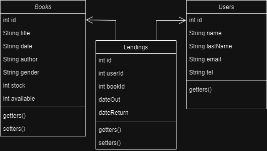

# CREACIÓN DE UNA APLICACIÓN DE BIBLIOTECA

## Descripción de la actividad

Los estudiantes deben crear una aplicación de biblioteca en Java que cumpla con los siguientes requisitos:

## Requisitos Funcionales

1. Gestión de Libros:
   - Los usuarios pueden agregar nuevos libros a la biblioteca.
   - Los usuarios pueden eliminar libros de la biblioteca.
2. Gestión de Usuarios:
   - Los usuarios pueden registrarse en el sistema.
   - Los usuarios pueden alquilar libros.
   - Los usuarios deben devolver los libros.
4. Consultas y Búsquedas:
   - Los usuarios pueden buscar libros en la biblioteca por título, autor o género.
5. Informes y Estadísticas:
   - Los usuarios pueden generar informes o estadísticas sobre el uso de la biblioteca.

 ## Requisitos Técnicos

- Utilizar programación orientada a objetos para diseñar las clases y objetos necesarios.
- Implementar manejo de excepciones para situaciones como devoluciones fuera de plazo o búsqueda de libros inexistentes.
- Utilizar interfaces y clases abstractas para definir un sistema de notificación a los usuarios.
- Aplicar programación funcional y Streams para consultas y generación de informes o estadísticas simples.
 
## Entregables

Los estudiantes deben entregar los siguientes elementos:

- El código fuente de la aplicación Java.
- Un documento de texto, o Readme, explicando la lógica utilizada para validar los datos y cómo se implementan las diferentes funcionalidades.
- Un informe detallado de cualquier problema que hayan enfrentado durante el desarrollo de la aplicación y cómo los resolvieron.

## Criterios de evaluación

Los proyectos de los estudiantes serán evaluados de acuerdo a los siguientes criterios:

- **Funcionalidad**: ¿La aplicación cumple con todos los requisitos funcionales especificados?
- **Validación de Datos**: ¿La aplicación valida correctamente los datos ingresados por el usuario?
- **Estructura del Código**: ¿El código está organizado de manera clara y utiliza las estructuras de control adecuadas?
- **Documentación**: ¿Los estudiantes proporcionan documentación clara sobre su código y cualquier problema resuelto?
- **Creatividad**: ¿Los estudiantes implementan funcionalidades adicionales o mejoras en la aplicación más allá de los requisitos mínimos?
 
Esta actividad permitirá a los estudiantes aplicar los conocimientos adquiridos en los módulos del curso relacionados con el entorno de desarrollo, variables, estructuras de control y almacenamiento de datos en Java. Además, les proporcionará experiencia práctica en la creación de aplicaciones Java funcionales.

---

# Resolución - Library App


Dado los requisitos del proyecto diseñe un app aplicando **POO**, **Interfaces**, **Streams**, **Java Swing** para las vistas y una arquitectura **MVC** con la siguiente estructura:

```bash
src/main/java
          ├───controllers
          ├───db
          ├───interfaces
          ├───models
          ├───services
          ├───utils
          ├───views
          └───Main.java
```

La aplicación inica en `Main.java` haciendo uso de `java.awt.EventQueue.invokeLater(new Runnable() { ... });`.
Este bloque de código es fundamental para la programación Swing. [EventQueue.invokeLater](https://docs.oracle.com/javase/8/docs/api/java/awt/EventQueue.html) se utiliza para garantizar que la creación y modificación de componentes de la interfaz gráfica se realicen en el hilo de despacho de eventos (Event Dispatch Thread - EDT) de Swing.
Dentro de este bloque se llama a la vista principal **Dashboard** la cual se encarga de administrar y mostrar todas las vistas de la aplicación `views`, para ello se hace uso de `ShowJPanel` un panel que según la acción dada por el menú lateral de navegación mostrará la vista correspondiente, cada uno de estas tiene su propia lógica y controladores.

```java

public class Main {
  public static void main(String args[]) {

        FlatMaterialLighterIJTheme.setup();

        java.awt.EventQueue.invokeLater(new Runnable() {
            public void run() {
                new Dashboard().setVisible(true);
            }
        });
    }
}

```

La lógica de toda el control y manejo de la aplicación pasa primeramente por `controllers` cada entidad o modelo, `Books`, `Users` y `Lendings` que se encuentra en `models` tiene su propio controlador, a su vez se hace uso de `interfaces` para Abstraer y establecer un contrato. Estos son implementados en cada DAO, acceso a datos que se encuentran en `db` cada uno administra los datos aplicando el contrato.



Para este caso, dado que aun no cursamos Base de Datos, investigué como hacer uso de archivos json y cree `DAOService` que junto con la dependencia `com.fasterxml.jackson.core` me permite acceder a cada arhivo data json correspondiente a los modelos, para ello hago uso de [generics](https://docs.oracle.com/javase/tutorial/java/generics/types.html). Este servicio tiene 2 métodos `loadFile()` y `saveFile` para leer y guardar respectivamente. 

La primera vista en aparecer es la Principal, que tiene información y una presentación de la app. Le siguen Préstamos `Lendings` y Devoluciones `Returns` ambas similares pero con una funcionalidad específica, recibir los id de usuario `User` y de libro `Book` y verificar que si se desea prestar, los id sean correctos, el libro esté disponible, que no se tenga en registro el mismo prestamo aun sin devolver, o en caso de ser una devolución que exista un pendiente sin fecha de retorno.
Posteriormente sigue Usuarios y Libros, ambos cuentan con una tabla que refleja los registros actuales, también cuentan con un cuadro de búsqueda por email en Usuarios y por título en Libros. Desde esta vista podemos tando editar, eliminar o crear un nuevo registro accediendo a un formulario con su validación respectiva, se hace uso de regex y condicionales para retornar en caso de errores.

Hablando de errores, se crea en services un clase abstracta para notificar usuarios que implementa una interfaz `NotificationInterface` la cual permite mostrar por ventanas con `JOptionPane` mensajes de información, errores o éxito cuando sea necesario, asi mantener una UI amigable con el usuario.

Para finalizar tenemos la vista de reportes la cual contiene 3 tablas, los movimientos de la biblioteca y en base a estos 2 tablas que muestran los usuarios mas activos y los libros mas solicitados. Para lograr esto se hace uso de HasMap, List y métodos de ordenamiento `.sort()` para obtener los primeros 3 datos de mayor actividad.

## Validación de datos

Las validaciones se encuentran en cada formulario dentro de las vistas, iniciando con `Lendings` y `Returns`, se valida que los datos no estén vacíos primeramente haciendo uso de métodos `trim()` `isEmpty()` posteriormente se verifica que sean números y id correctos con un método de utils `isNumeric()`, al asegurarnos de tener los datos correctos se procede a buscar en base de datos, si los datos de usuario y del libro son correctos haciendo uso de los controladores `getUser` y `getBook`, pasamos a comprobar que se disponga del libro en inventario para ello se comprueba el atributo `available` y para finalizar comprobamos que no exista un prestamo existente del mismo libro al mismo usuario sin retorno por lo cual impedimos el préstamo repetido, pasando estás validaciones se crea un nueva instancia de Lending con los id correspondiente y la fecha actual, se registra haciendo uso de su controller y se modifica los valores del atributo `available` del libro prestado, reduciendolo en una unidad. Por otra parte `Returns` cuenta con las mismas primeras validaciones, pero luego se verifica que exista un lending correspondiente a los id y que su atributo `returnDate` sea null, de esta manera se comprueba la deuda y se hace el registro del retorno con la fecha actual.

Pasando a los formularios de creación de libros y usuarios, ambos cuentan con validaciones de los datos no pueden estar vacíos, además se usan `regex` para comprobar que en el caso de los usuarios los datos como el email `email.matches("^[A-Za-z0-9._%+-]+@[A-Za-z0-9.-]+\\.[A-Za-z]{2,6}$")` y el tel sean válidos `tel.matches("\\d{10}")`, ya que pueden ser necesarios en caso de necesidad de contactarlos. Las demás validaciones nos asegura que los datos sean del tipo esperado.

## Informe de problemas solucionados

El primer desafío fue plantear el proyecto ya que tenía ciertos requisitos que podrían interpretarse de distintas muchas maneras, por ejemplo el requisito de registrar usuarios, podría plantearse desde el lado de requerir un login, en este caso no opte por eso, sino mas bien pensé la aplicación para administrar una biblioteca y darle al administrador del programa la capacidad de registrar usuarios y libros nuevos, como así también modificarlos y/o eliminarlos.

El segundo desafío fue plantear como manejar la información, podría hacerse en memoria sin persistencia, pero decidí añadir archivos json, para ello tuve que investigar la manera de hacerlo en java, también tuve que aplicar **generics** para reutilizar el código y aplicarlos a todos los modelos. Con la dependencia adecuada y creando un servicio que me permita acceder y manipular la información del archivo decidí utilizarlo como base de datos, a su vez establecí una estructura en el proyecto que me permita a futuro reemplazarla por una base de datos.

El último desafíó fue cear las vistas UI, en este caso quise mejorar la presentación de la app investigando un poco mas sobre Swing, también encontré en esta búsqueda una librería con temas [formdev](https://www.formdev.com/flatlaf/) la cual apliqué en Main en la línea `FlatMaterialLighterIJTheme.setup();` para mejorar algunos estilos.

En conclusión no tuve grandes inconvenientes salvo el tiempo, esta app fue realizada en menos de una semana y seguramente tenga cosas para mejorar, pero estoy contento con el resultado logrado.